# Exploratory Data Analysis Report

_Generated: 2026-07-12T14:44:53.294100+00:00_

## Dataset

- Source split: `train`
- Shape: 4773 rows × 96 cols
- Target column: `Bankrupt?`
- Analyzers run: 10 (0 skipped)
- Figures generated: 11

## Executive summary

**Severe class imbalance: 29.994:1 (positive class only 3.2265% of samples).**

Insights: {'critical': 1, 'warning': 3, 'info': 6}

### Prioritized insights

| Severity | Category | Finding | Recommendation |
|----------|----------|---------|----------------|
| 🔴 critical | class_imbalance | Severe class imbalance: 29.994:1 (positive class only 3.2265% of samples). | Use class weighting or resampling (SMOTE/undersampling) and evaluate with PR-AUC / recall, not accuracy. |
| 🟠 warning | feature_distribution | 67 feature(s) are highly skewed and 62 are heavy-tailed. | Apply log/Box-Cox/Yeo-Johnson transforms or robust scaling for linear/distance-based models. |
| 🟠 warning | multicollinearity | 93 highly-correlated feature pair(s) and 47 feature(s) with high VIF detected. | Drop/combine redundant ratios or use regularized / tree-based models robust to collinearity. |
| 🟠 warning | outliers | Features average 8.1% IQR outliers after preprocessing. | Revisit winsorization limits or use outlier-robust models; extreme ratios may be economically meaningful. |
| 🔵 info | data_quality | No missing values in the processed dataset. | No imputation needed downstream. |
| 🔵 info | outliers | Isolation-Forest flags 5.5311% of rows as multivariate anomalies. | Inspect flagged firms — they may be genuine distress cases or data-entry errors. |
| 🔵 info | financial_signal | Most bankruptcy-discriminative ratios: Net Income to Stockholder's Equity, Borrowing dependency, Total debt/Total net worth, Net Income to Total Assets, Liability to Equity. | Prioritize these (and their categories) in feature selection and in the model-explainability narrative. |
| 🔵 info | financial_signal | 'interest_rate' is the strongest financial category for separating bankrupt vs solvent firms. | Ensure this category is well represented after any feature pruning. |
| 🔵 info | predictive_power | Strongest univariate predictor: 'Persistent EPS in the Last Four Seasons' (AUC 0.116). | Even single ratios carry signal; expect tree ensembles to exploit their interactions. |
| 🔵 info | dimensionality | Only 42 of 95 components explain 95% of variance (redundancy index 0.5579). | Consider PCA/feature selection to cut dimensionality and speed up training without losing much signal. |

## Analyzer details

### overview  (completed)

- 4773 rows x 96 cols; 95 numeric / 0 categorical; 3.496 MB

```json
{
  "n_rows": 4773,
  "n_cols": 96,
  "n_features": 95,
  "n_numeric_features": 95,
  "n_categorical_features": 0,
  "memory_bytes": 3665792,
  "memory_mb": 3.496,
  "feature_names": [
    "ROA(C) before interest and depreciation before interest",
    "ROA(A) before interest and % after tax",
    "ROA(B) before interest and depreciation after tax",
    "Operating Gross Margin",
    "Realized Sales Gross Margin",
    "Operating Profit Rate",
    "Pre-tax net Interest Rate",
    "After-tax net Interest Rate",
    "... (+87 more)"
  ],
  "target_col": "Bankrupt?",
  "target": {
    "dtype": "int64",
    "n_classes": 2,
    "class_counts": {
      "0": 4619,
      "1": 154
    },
    "is_binary": true
  }
}
```

Tables: `statistics/overview__feature_types.csv`

### target  (completed)

- 4773 samples; imbalance ratio 29.994:1 (positive 3.2265%)

```json
{
  "n_samples": 4773,
  "n_classes": 2,
  "class_counts": {
    "0": 4619,
    "1": 154
  },
  "class_percentages": {
    "0": 96.7735,
    "1": 3.2265
  },
  "majority_count": 4619,
  "minority_count": 154,
  "imbalance_ratio": 29.994,
  "positive_count": 154,
  "negative_count": 4619,
  "positive_pct": 3.2265,
  "is_imbalanced": true
}
```

Tables: `statistics/target__target_distribution.csv`

### descriptive  (completed)

- described 95 numeric feature(s)

```json
{
  "n_features_described": 95,
  "percentiles": [
    1,
    5,
    10,
    25,
    50,
    75,
    90,
    95,
    "... (+1 more)"
  ],
  "mean_abs_skew": 2.0246549300472334,
  "mean_kurtosis": 9.603297089082222
}
```

Tables: `statistics/descriptive__descriptive_statistics.csv`

### missing  (completed)

- no missing values in the processed dataset
- 0 missing cell(s) across 0 feature(s)

```json
{
  "total_missing_cells": 0,
  "overall_missing_pct": 0.0,
  "n_features_with_missing": 0,
  "top_missing": []
}
```

Tables: `statistics/missing__missing_values.csv`

### outliers  (completed)

- 36822 IQR outlier cell(s); mean 8.12% per feature

```json
{
  "iqr_multiplier": 1.5,
  "zscore_threshold": 3.0,
  "n_features": 95,
  "total_iqr_outliers": 36822,
  "total_zscore_outliers": 8759,
  "mean_iqr_outlier_pct": 8.120674736842105,
  "top_outlier_features": [
    {
      "feature": "Degree of Financial Leverage (DFL)",
      "iqr_outlier_pct": 22.0197,
      "zscore_outlier_pct": 2.0532
    },
    {
      "feature": "Fixed Assets Turnover Frequency",
      "iqr_outlier_pct": 21.0978,
      "zscore_outlier_pct": 3.2474
    },
    {
      "feature": "Interest Coverage Ratio (Interest expense to EBIT)",
      "iqr_outlier_pct": 21.014,
      "zscore_outlier_pct": 3.0798
    },
    {
      "feature": "Current Asset Turnover Rate",
      "iqr_outlier_pct": 20.4484,
      "zscore_outlier_pct": 1.5923
    },
    {
      "feature": "Total Asset Growth Rate",
      "iqr_outlier_pct": 20.2179,
      "zscore_outlier_pct": 0.0
    },
    {
      "feature": "Interest Expense Ratio",
      "iqr_outlier_pct": 20.1341,
      "zscore_outlier_pct": 3.2055
    },
    {
      "feature": "Cash Flow to Liability",
      "iqr_outlier_pct": 17.9342,
      "zscore_outlier_pct": 3.415
    },
    {
      "feature": "No-credit Interval",
      "iqr_outlier_pct": 16.321,
      "zscore_outlier_pct": 3.6246
    },
    "... (+7 more)"
  ],
  "isolation_forest": {
    "available": true,
    "n_anomalies": 264,
    "anomaly_pct": 5.5311,
    "min_score": -0.629345933941696,
    "mean_score": -0.4118991689912868
  }
}
```

Tables: `statistics/outliers__outlier_summary.csv`

### distributions  (completed)

- 67 highly-skewed, 62 heavy-tailed of 95 feature(s)

```json
{
  "n_features": 95,
  "n_highly_skewed": 67,
  "n_heavy_tailed": 62,
  "highly_skewed": [
    "Operating Gross Margin",
    "Realized Sales Gross Margin",
    "Operating Profit Rate",
    "Pre-tax net Interest Rate",
    "After-tax net Interest Rate",
    "Continuous interest rate (after tax)",
    "Operating Expense Rate",
    "Research and development expense rate",
    "... (+17 more)"
  ],
  "heavy_tailed": [
    "Operating Profit Rate",
    "Pre-tax net Interest Rate",
    "After-tax net Interest Rate",
    "Non-industry income and expenditure/revenue",
    "Continuous interest rate (after tax)",
    "Cash flow rate",
    "Interest-bearing debt interest rate",
    "Net Value Per Share (B)",
    "... (+17 more)"
  ]
}
```

Tables: `statistics/distributions__distribution_shape.csv`

### correlation  (completed)

- 93 pair(s) |r|>=0.8; 47 feature(s) VIF>10.0

```json
{
  "n_features": 95,
  "high_correlation_threshold": 0.8,
  "n_high_correlation_pairs": 93,
  "top_pairs": [
    {
      "feature_a": "Current Liabilities/Equity",
      "feature_b": "Current Liability to Equity",
      "pearson_r": 1.0
    },
    {
      "feature_a": "Current Liabilities/Liability",
      "feature_b": "Current Liability to Liability",
      "pearson_r": 1.0
    },
    {
      "feature_a": "Debt ratio %",
      "feature_b": "Net worth/Assets",
      "pearson_r": -1.0
    },
    {
      "feature_a": "Operating Gross Margin",
      "feature_b": "Gross Profit to Sales",
      "pearson_r": 0.999999984545077
    },
    {
      "feature_a": "Net Value Per Share (A)",
      "feature_b": "Net Value Per Share (C)",
      "pearson_r": 0.9998384374943013
    },
    {
      "feature_a": "Net Value Per Share (B)",
      "feature_b": "Net Value Per Share (A)",
      "pearson_r": 0.9998080685626872
    },
    {
      "feature_a": "Net Value Per Share (B)",
      "feature_b": "Net Value Per Share (C)",
      "pearson_r": 0.9996461962822704
    },
    {
      "feature_a": "Operating Gross Margin",
      "feature_b": "Realized Sales Gross Margin",
      "pearson_r": 0.9988435903221798
    },
    "... (+7 more)"
  ],
  "vif_threshold": 10.0,
  "n_high_vif": 47,
  "high_vif_features": [
    "Operating Gross Margin",
    "Gross Profit to Sales",
    "Net Value Per Share (A)",
    "Net Value Per Share (C)",
    "Net Value Per Share (B)",
    "Operating Profit Per Share (Yuan \u00a5)",
    "Operating profit/Paid-in capital",
    "Realized Sales Gross Margin",
    "... (+12 more)"
  ]
}
```

Tables: `statistics/correlation__correlation_kendall.csv`, `statistics/correlation__correlation_pearson.csv`, `statistics/correlation__correlation_spearman.csv`, `statistics/correlation__high_correlation_pairs.csv`, `statistics/correlation__multicollinearity_vif.csv`

### ratios  (completed)

- 95 ratios in 7 categories; target-conditioned

```json
{
  "n_ratios": 95,
  "categories": {
    "profitability": 30,
    "leverage": 22,
    "liquidity": 14,
    "other": 13,
    "efficiency": 10,
    "interest_rate": 4,
    "growth": 2
  },
  "target_conditioned": true,
  "top_discriminative": [
    {
      "feature": "Net Income to Stockholder's Equity",
      "category": "profitability",
      "cohens_d": -2.024494310860355,
      "mean_solvent": 0.06151444974500832,
      "mean_bankrupt": -1.8450340478718845
    },
    {
      "feature": "Borrowing dependency",
      "category": "leverage",
      "cohens_d": 1.9656533420295688,
      "mean_solvent": -0.059921671024376344,
      "mean_bankrupt": 1.7972610289712863
    },
    {
      "feature": "Total debt/Total net worth",
      "category": "leverage",
      "cohens_d": 1.8777519548525088,
      "mean_solvent": -0.05751348469668205,
      "mean_bankrupt": 1.7250310767141157
    },
    {
      "feature": "Net Income to Total Assets",
      "category": "profitability",
      "cohens_d": -1.7123339760110068,
      "mean_solvent": 0.05289067781389604,
      "mean_bankrupt": -1.5863768884570713
    },
    {
      "feature": "Liability to Equity",
      "category": "leverage",
      "cohens_d": 1.7031070701250168,
      "mean_solvent": -0.052629412594782696,
      "mean_bankrupt": 1.5785406284111545
    },
    {
      "feature": "Retained Earnings to Total Assets",
      "category": "profitability",
      "cohens_d": -1.6100086046527076,
      "mean_solvent": 0.04997371878875066,
      "mean_bankrupt": -1.498887058994774
    },
    {
      "feature": "ROA(A) before interest and % after tax",
      "category": "profitability",
      "cohens_d": -1.5238547781142,
      "mean_solvent": 0.047485158315555866,
      "mean_bankrupt": -1.4242464042828165
    },
    {
      "feature": "ROA(B) before interest and depreciation after tax",
      "category": "profitability",
      "cohens_d": -1.49718715335598,
      "mean_solvent": 0.046708993397324525,
      "mean_bankrupt": -1.4009664967677822
    },
    "... (+7 more)"
  ],
  "category_strength": {
    "interest_rate": 1.2694,
    "profitability": 1.0074,
    "leverage": 0.8144,
    "growth": 0.558,
    "liquidity": 0.4729,
    "other": 0.4465,
    "efficiency": 0.1869
  }
}
```

Tables: `statistics/ratios__ratio_categories.csv`, `statistics/ratios__ratio_discrimination.csv`

### relationships  (completed)

- ranked 95 features vs target; max |r|=0.337

```json
{
  "n_features": 95,
  "positive_class": "1",
  "mutual_info_available": true,
  "top_by_separability": [
    {
      "feature": "Persistent EPS in the Last Four Seasons",
      "point_biserial_r": -0.24012575677506282,
      "mutual_info": 0.042079070369428484,
      "univariate_auc": 0.11552719849970337,
      "separability": 0.7689456030005932
    },
    {
      "feature": "Net Income to Total Assets",
      "point_biserial_r": -0.289662819324115,
      "mutual_info": 0.03483650762810098,
      "univariate_auc": 0.1224607282736748,
      "separability": 0.7550785434526504
    },
    {
      "feature": "Net profit before tax/Paid-in capital",
      "point_biserial_r": -0.22739118364872885,
      "mutual_info": 0.03888059657723475,
      "univariate_auc": 0.12406758645121928,
      "separability": 0.7518648270975614
    },
    {
      "feature": "Per Share Net profit before tax (Yuan \u00a5)",
      "point_biserial_r": -0.22801401956014528,
      "mutual_info": 0.0396521883641785,
      "univariate_auc": 0.1248717184525801,
      "separability": 0.7502565630948398
    },
    {
      "feature": "Total debt/Total net worth",
      "point_biserial_r": 0.31498023498609895,
      "mutual_info": 0.037472929919869946,
      "univariate_auc": 0.8742897068292176,
      "separability": 0.7485794136584352
    },
    {
      "feature": "Continuous interest rate (after tax)",
      "point_biserial_r": -0.2535492286395594,
      "mutual_info": 0.03681749604466478,
      "univariate_auc": 0.12917284058223655,
      "separability": 0.7416543188355269
    },
    {
      "feature": "Borrowing dependency",
      "point_biserial_r": 0.32816898714373305,
      "mutual_info": 0.03798432752131409,
      "univariate_auc": 0.8704890584626458,
      "separability": 0.7409781169252916
    },
    {
      "feature": "Retained Earnings to Total Assets",
      "point_biserial_r": -0.27368770593924907,
      "mutual_info": 0.029979271630338644,
      "univariate_auc": 0.12999946578643265,
      "separability": 0.7400010684271348
    },
    "... (+12 more)"
  ],
  "max_abs_point_biserial": 0.33689205128004,
  "mean_separability": 0.4362720061584022
}
```

Tables: `statistics/relationships__feature_target_relationships.csv`

### dimensionality  (completed)

- 42 PCs explain 95% of variance (95 features); PC1=22.0%

```json
{
  "n_features": 95,
  "n_components": 95,
  "pc1_variance": 0.22028620996795914,
  "pc2_variance": 0.1183475494187914,
  "top5_cumulative_variance": 0.5005348441201014,
  "n_components_80pct": 22,
  "n_components_90pct": 33,
  "n_components_95pct": 42,
  "n_components_99pct": 59,
  "redundancy_index": 0.5579
}
```

Tables: `statistics/dimensionality__pca_explained_variance.csv`

## Figures

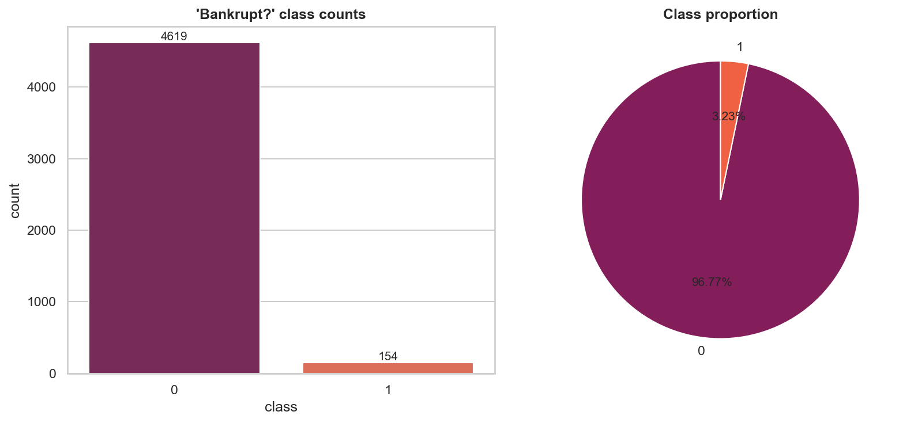

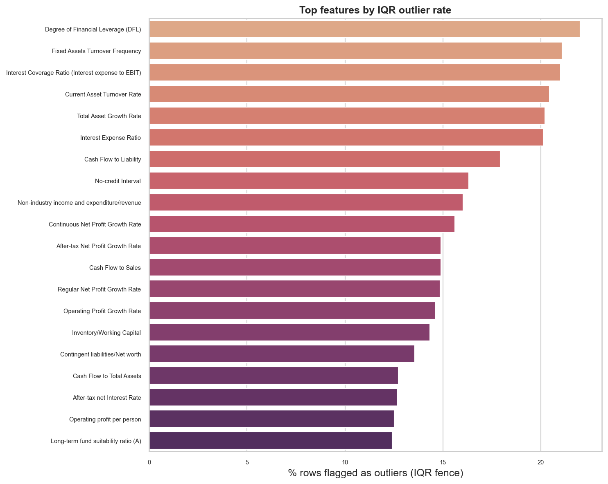

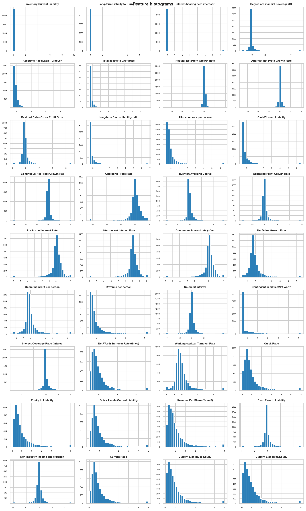

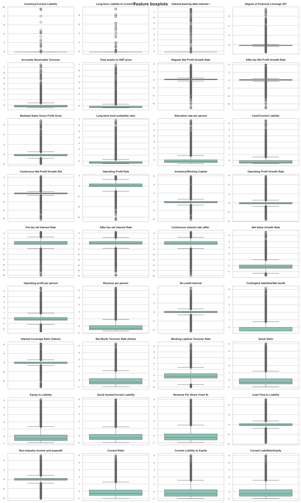

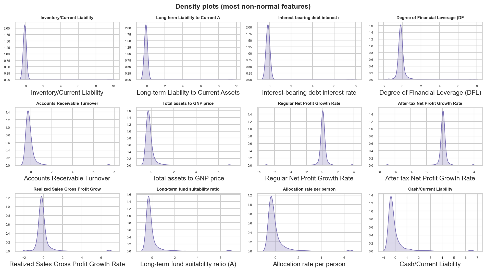

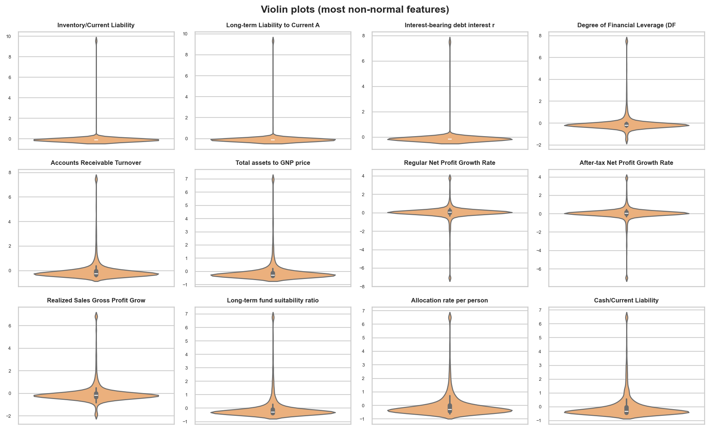

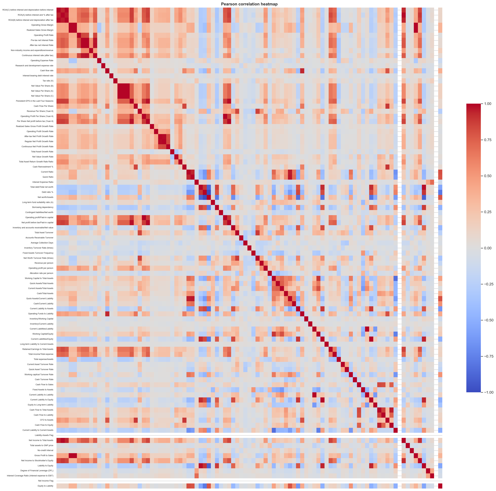

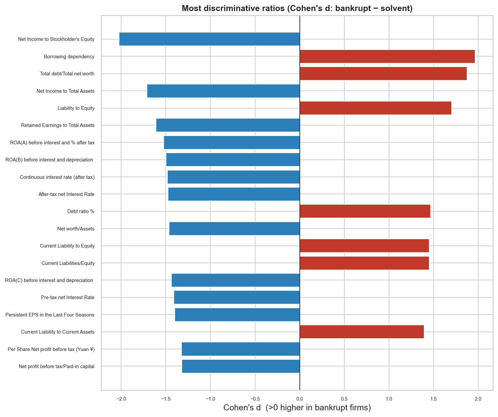

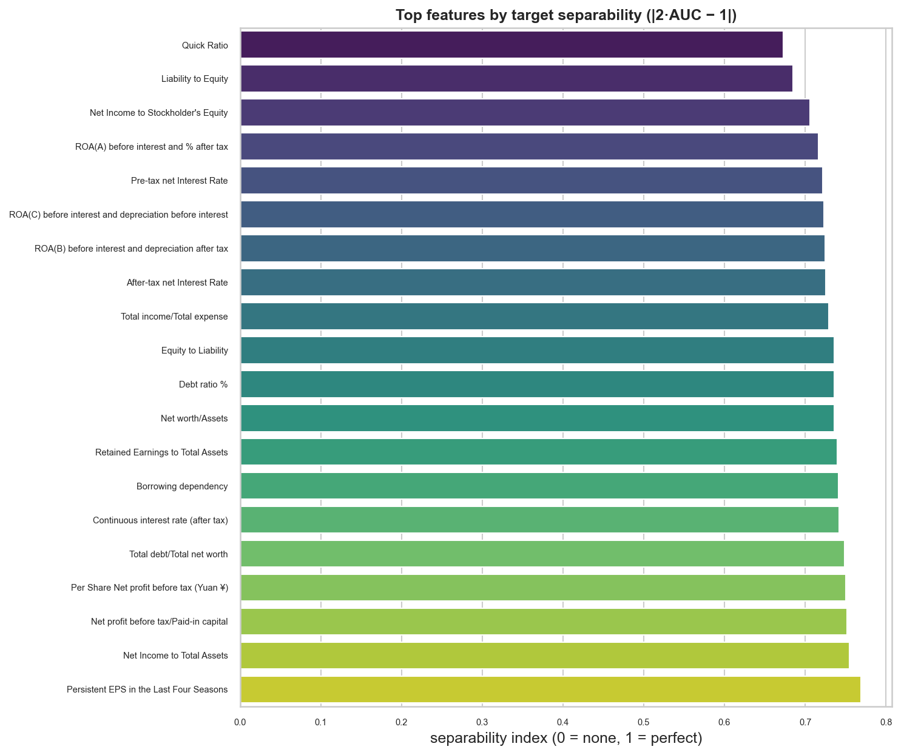

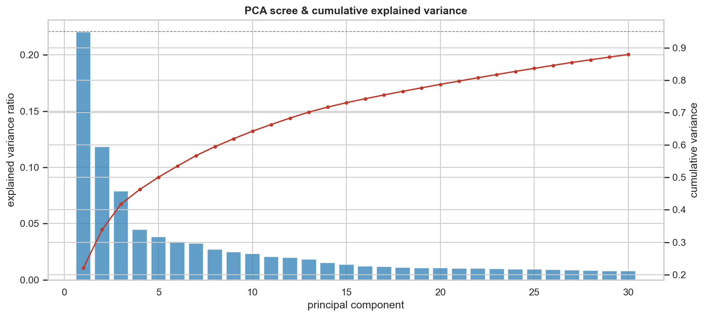

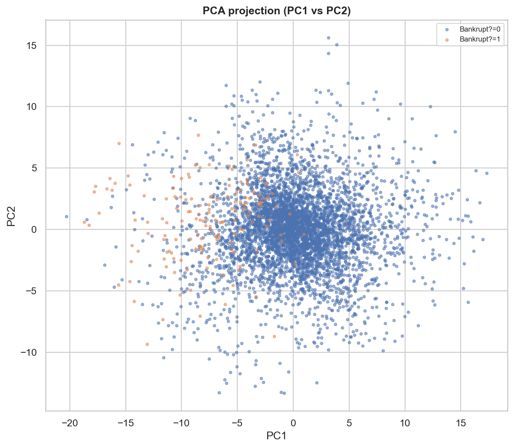
